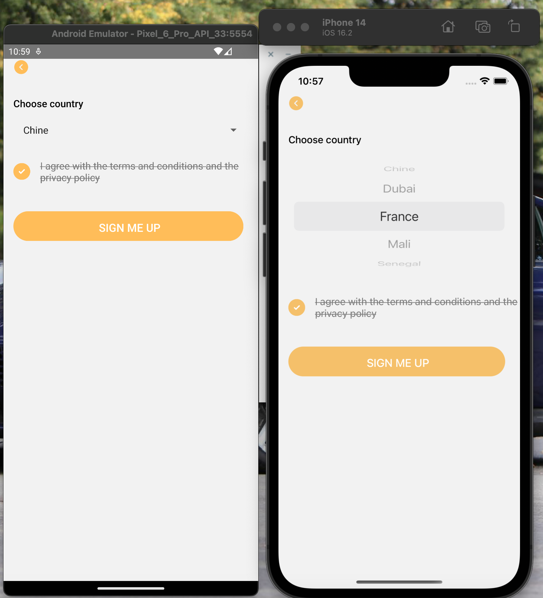

<p align='center'>




</p>

# Pakenative CLI - Bootstrap a sweet React Native App boilerplate with Pakenfit style🔥


## A Sweet React Native App 

I love React Native and used it for few years.
This boilerplate was originally for my projects and I realize that it can help others. So just enjoy!🔥

## Get started

To bootstrap your React Native App run the CLI:
```shell
$ npx pakenative-cli new myApp
```

To check the version of the CLI:
```shell
$ npx pakenative-cli --version (or -v)
```

To display available commands the CLI:
```shell
$ npx pakenative-cli --help (or -h)
```

## TODO
- [ ] Add multiple options 
- [ ] Add more styles
- [ ] Add more tests
- [ ] Add more components and more screens
# License

MIT - see LICENSE

